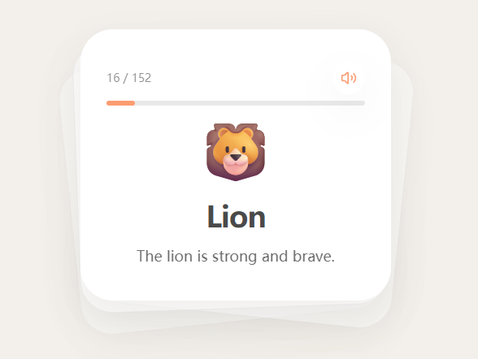

# word-cards

Warm, minimalist English flashcards for kids (3–6) designed for quick daily practice.
Each card pairs a clear word with a short, kid-friendly example phrase and optional text-to-speech audio.
Swipe through the deck like real cards—simple UI, big type, and low distraction.



Swipe left/right to move through cards. Tap the card (or the speaker button) to hear the word first, then a short example phrase.

## Tech

- Next.js (App Router) + React + TypeScript
- Tailwind CSS v4
- Framer Motion (swipe interactions)
- Gemini TTS via `@google/genai` (server route)

## Getting Started

### 1) Install

```bash
pnpm install
```

### 2) Configure TTS

Copy `.env.example` to `.env.local` and set:

```bash
GOOGLE_GENERATIVE_AI_API_KEY=...
```

Required (for persistent audio caching on Vercel Blob):

```bash
BLOB_READ_WRITE_TOKEN=...
```

Optional:

```bash
TTS_VOICE_NAME=Kore
```

If the API key is missing, the app still runs but audio playback will fail.

### 3) Run

```bash
pnpm dev
```

Open http://localhost:3000

## Content

Flashcard content lives in `content.json` (word + phrase per emoji id). The app builds the deck from that file.

## Notes

- TTS audio is cached in Vercel Blob (persistent across deploys/instances).
- The `/api/tts` endpoint returns audio URLs (word + phrase).

## AI Disclosure

Some of the flashcard content (especially example phrases) may be AI-generated. Please review and edit `content.json` as needed.
